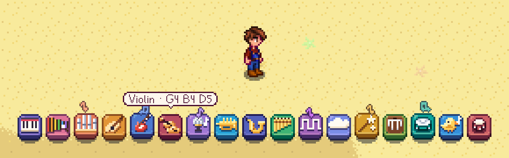
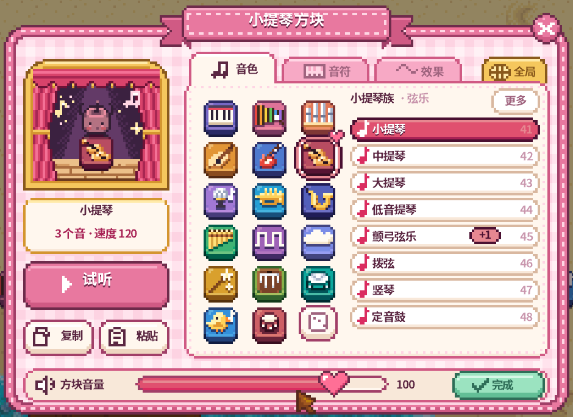
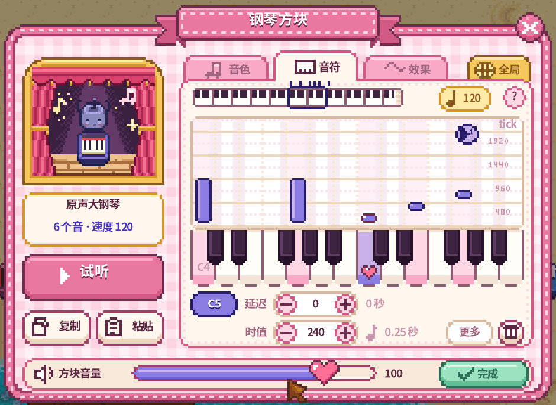
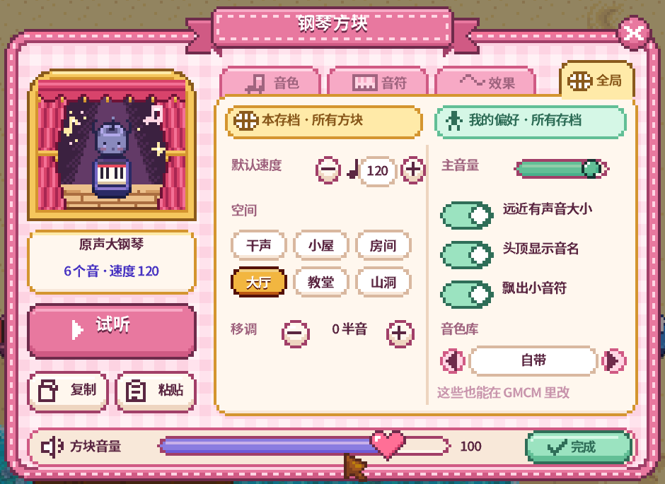

# 祝尼魔乐团 Junimo Orchestra

给星露谷加 17 种乐器方块，覆盖全部 General MIDI 音色。走过方块它就会响；右键打开草莓牛奶配色的调音面板。还有三种祝尼魔会帮你演奏。

**[English](README.md)** · **[下载](https://github.com/link1412/JunimoStudio/releases)**

## 安装

1. 安装 [SMAPI](https://smapi.io/) 4.0 或更高版本（星露谷 1.6）。
2. 把发布包解压到游戏的 `Mods` 文件夹，会得到两个文件夹：`JunimoOrchestra` 是模组本体，`[JO] Custom` 放你自己的音色库和贴图（更新模组不会动它）。
3. 启动游戏，17 个方块的配方一开始就会：5 木材 + 5 纤维做 100 个。

**示例存档**：[JunimoOrchestra-showcase-save.zip](https://github.com/link1412/JunimoStudio/releases/download/v1.0.0/JunimoOrchestra-showcase-save.zip) 是一个房子下面摆好四排曲子的农场：《致爱丽丝》（两种摆法）、德彪西《第一阿拉伯风格曲》、莫扎特《弦乐小夜曲》。解压到存档文件夹（Windows：`%AppData%\StardewValley\Saves`；macOS 和 Linux：`~/.config/StardewValley/Saves`），载入 Maestro 的农场，用 100% 的速度沿着每条小路从左往右跑。

## 怎么玩

| 操作 | 效果 |
|---|---|
| 走到方块旁边 | 演奏（站着不动不会重复） |
| 鼠标停在方块上 | 显示音色和音符，以及从哪些格子能触发它 |
| 右键方块 | 打开调音面板；空格试听 |
| `[` / `]` / `\` | 走慢一点 / 快一点 / 回到 100%（25%–200%；按住 Shift 每次 5%） |

一排方块就是跟着脚步走的曲子。100% 速度跑一格 0.2 秒，所以一格可以是 75 BPM 的十六分音符，或者 150 BPM 的八分音符；慢歌就走慢一点，头顶的小牌子会显示走一格要多久。一个方块也可以装一整小节，按它自己的速度排好时间，下一个方块放在下一小节开始的位置。

方块拆下来再放下去，设置还在；设置不同的方块不会叠在一起。面板里的**复制 / 粘贴**会复制整块设置，也会复制到系统剪贴板，可以发给朋友。

## 调音面板

| 音色 | 音符 | 全局 |
|---|---|---|
|  |  |  |

- **音色**：GM 的 16 个乐器家族加一套架子鼓，每族 8 个音色，还有它们的变体。自带的音色库（GeneralUser GS）有全部 128 个 GM 音色、133 个变体和 13 套鼓组。骰子随机挑一个。
- **音符**：简化音符页按八度和音名选音，时值和延迟照乐谱上的写法选，可以照着乐谱一个方块一个方块地调。完整的钢琴卷帘（在全局页打开）有全部 128 个音高、力度和精确的 MIDI tick，一个方块最多 64 个音。
- **效果**：混响、合唱、颤音、声像；谁能触发（自己、村民、小动物），从多远触发（直线上最远 8 格）。
- **全局**：本存档的速度、触发距离、混响空间、移调，没单独设置的方块都跟着它；我自己的音量、显示偏好和音色库。

音符页的鼠标和键盘操作

简化音符页：

| 操作 | 效果 |
|---|---|
| 点上面的音 | 选中它（并试听） |
| 点八度 / 音名 | 把选中的音换过去（C-1 到 G9） |
| 点时值 | 全音符到十六分音符；小圆点是附点，再长一半 |
| 点延迟 | 踩到以后晚多久响（0 是马上响） |
| + / 垃圾桶 | 在同一时刻再加一个音（和弦）/ 删掉选中的音 |

完整音符页：

| 操作 | 效果 |
|---|---|
| 左键琴键 | 把选中的音换成这个音高（没有选中的音时加一个） |
| 右键琴键 | 在同一时刻叠一个音；已有则移除 |
| 左键空白处 | 在那个位置加一个音 |
| 拖音符 / 拖音符上沿 | 改延迟和音高 / 改时值（吸附到其他音的边缘和每 120 tick） |
| 右键音符（或 Delete） | 删除 |
| ← → / ↑ ↓ | 选中的音移半音 / 移八度 |
| 按住 Shift | ± 和拖动都精确到 1 tick |
| 点数字 | 直接输入，Enter 确认 |

## 祝尼魔

修好社区中心后，祝尼魔会留给你三个配方（不要材料，一次 100 个）：

- **古典祝尼魔**：穿礼服，抱着气派的乐器（竖琴、三角钢琴、低音提琴、定音鼓……）
- **祝尼魔乐手**：真的在拉弓、拨弦、敲鼓
- **乐队祝尼魔**：从祝尼魔小屋里跑出来的祝尼魔，拿着这一族的乐器（键盘、键盘吉他、电吉他、麦克风、架子鼓……）

它们和方块一样演奏，调成什么乐器就换上什么乐器。

## 换音色库和贴图

放在 `Mods/[JO] Custom` 里（详细说明见里面的 `README.txt`）：

- **`soundfonts/`**：放进 `.sf2`，在全局页用 ‹ › 选。音色名、变体和鼓组都跟着音色库走。加载不了的话继续用自带的，并提示原因。音色库是每个玩家自己选的。
- **`textures/`**：和 `JunimoOrchestra/assets/textures/` 里的图同名同尺寸的 png 会替换掉原图：方块、祝尼魔、物品图标、面板、小音符都能换。也可以用 Content Patcher 改，它们是游戏资源 `Mods/link1412.JunimoOrchestra/Blocks`、`Items`、`Classical`、`Band`、`Orchestra`、`UI`、`Fx`。
- **分享**：复制一份这个文件夹，起个自己的名字和 UniqueID。这样的文件夹可以同时装好几个。

## 设置

都在面板的全局页、[Generic Mod Config Menu](https://www.nexusmods.com/stardewvalley/mods/5098)（可选）和 `config.json` 里：

| 设置 | 默认 | 作用 |
|---|---|---|
| `MasterVolume` | 100 | 所有方块的音量，0–127 |
| `SpatialAudio` | true | 离得越远越小声，左右声道跟着位置走 |
| `ShowLabels` | true | 鼠标停在方块上时显示音色和音符 |
| `NoteParticles` | true | 演奏时飘出小音符 |
| `SimpleNotes` | true | 简化音符页；关掉是完整的钢琴卷帘 |
| `AutoLearnRecipes` | true | 自动学会配方 |
| `SpeedSlower` / `SpeedFaster` / `SpeedReset` | `[` / `]` / `\` | 走路速度的按键 |
| `SoundFont` | `""` | 留空 = 自带的；`内容包 UniqueID/文件名`，或者完整路径 |

存档的速度、触发距离、混响空间、移调存在存档里。

和 MIDI 的对应

| 本模组 | MIDI |
|---|---|
| 音高 / 延迟 / 时值 | Note On/Off 的音符号、时间位置、间隔（四分音符 = 480 tick） |
| 力度 | Note On velocity |
| 乐器 | Bank Select（CC0）+ Program Change；鼓组 = bank 128 |
| 音量 / 混响 / 合唱 / 颤音 / 声像 | CC7 / CC91 / CC93 / CC1 / CC10 |
| 速度 | Set Tempo，每个方块一个 |

## 兼容性

- 星露谷 1.6 + SMAPI 4.0 以上，鼠标和键盘，中文和英文界面。在 macOS 上测过；声音走游戏自己的音频输出，Windows 和 Linux 应该一样能用。
- 联机还没有充分测试。每个方块的设置存在方块自己身上，装了模组的玩家听到的是同一个调子；存档的速度、触发距离、空间、移调暂时只对房主有效。

## 致谢与许可

- 音色库：**GeneralUser GS v2.0.3** by S. Christian Collins，可自由使用和随软件分发（`assets/licenses/GeneralUser-GS-LICENSE.txt`）。
- 合成器：**MeltySynth 2.4.1** by Nobuaki Tanaka，MIT 许可（`assets/licenses/MeltySynth-LICENSE.txt`），有几处修改，编进 `Junimo.Engine.dll`，程序集名是我们自己的，不会和其他带 MeltySynth 的模组冲突。
- 所有贴图都是用代码画的（`art/`）。模组自己的代码：MIT 许可（`LICENSE`）。星露谷和祝尼魔属于 ConcernedApe。

从源码构建：见 [docs/DEVELOPMENT.md](docs/DEVELOPMENT.md)。
