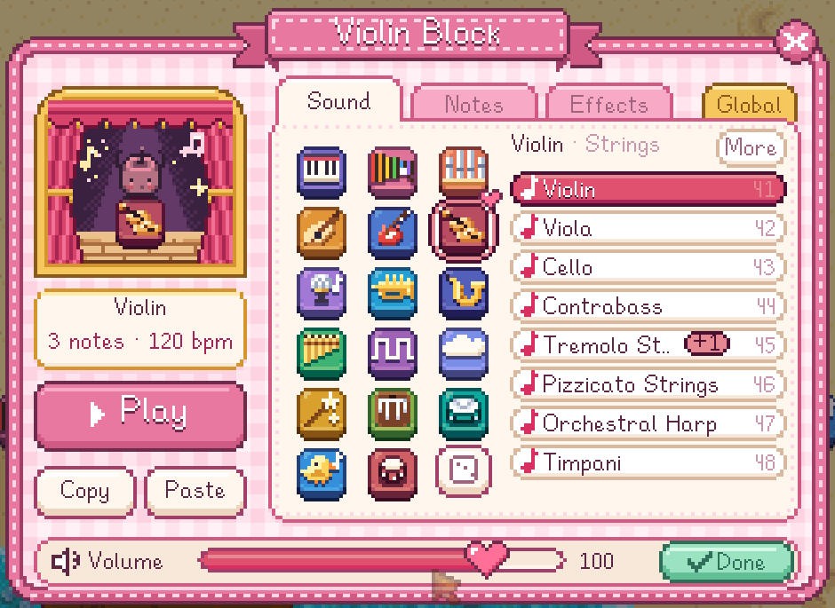
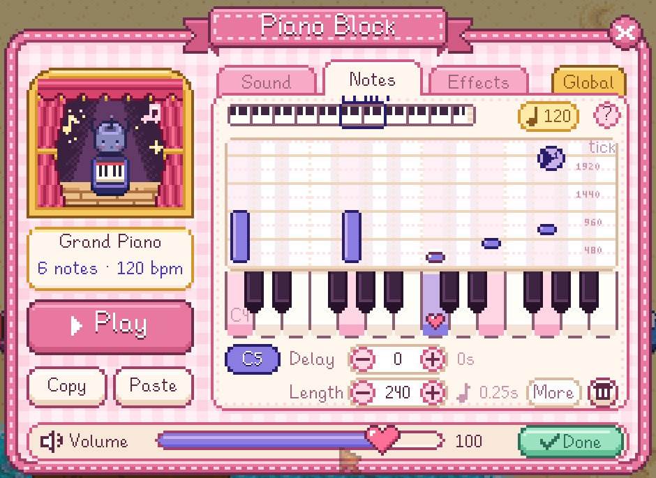
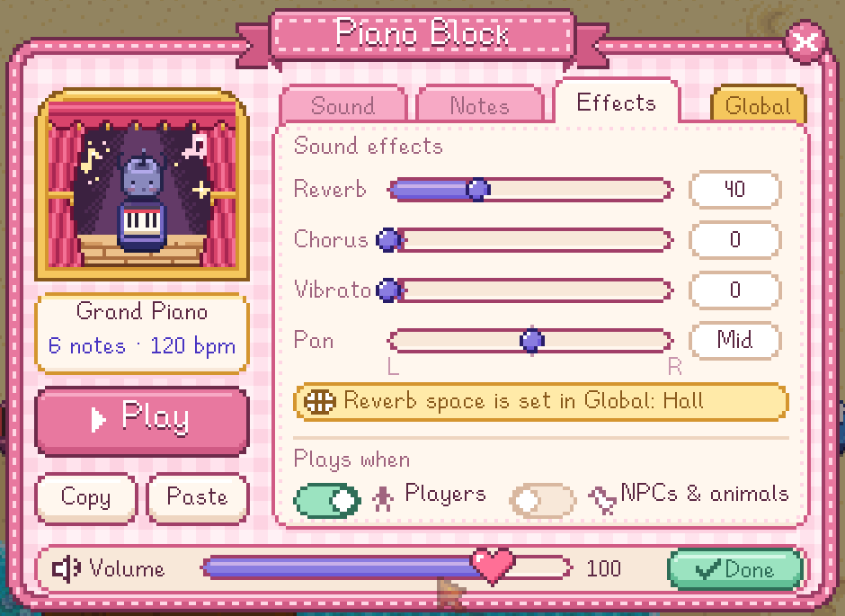
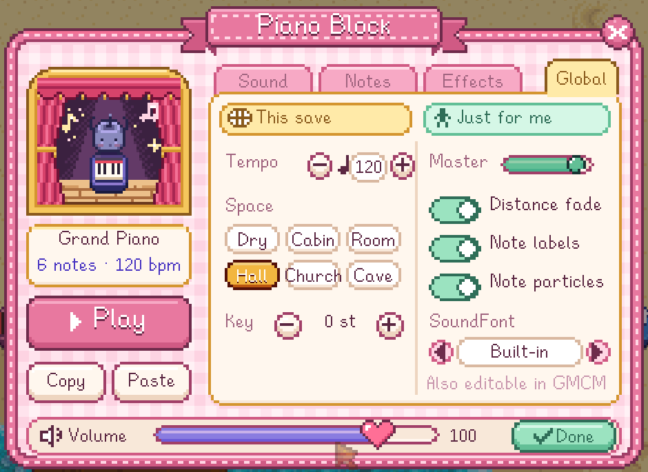

# Junimo Orchestra

17 instrument blocks for Stardew Valley that play every General MIDI instrument. Walk past a block and it plays;
right-click it to tune it in a strawberry-milk panel. Three kinds of Junimo can play them too.

**[中文说明](README.zh.md)** · **[Download](https://github.com/link1412/JunimoStudio/releases)**

## Install

1. Install [SMAPI](https://smapi.io/) 4.0 or later (Stardew Valley 1.6).
2. Unzip the release into your game's `Mods` folder. You get two folders: `JunimoOrchestra`, the mod, and
   `[JO] Custom`, for your own SoundFonts and pictures (an update never touches it).
3. Start the game. You know the 17 block recipes right away: 5 wood and 5 fiber make 100 blocks.

**Example save:** [JunimoOrchestra-showcase-save.zip](https://github.com/link1412/JunimoStudio/releases/download/v1.0.0/JunimoOrchestra-showcase-save.zip)
is a farm with four rows of tunes below the house: *Für Elise* (two ways), Debussy's *First Arabesque* and Mozart's
*Eine kleine Nachtmusik*. Unzip it into your saves folder (`%AppData%\StardewValley\Saves` on Windows,
`~/.config/StardewValley/Saves` on macOS and Linux), load Maestro's farm and run along each path from left to right at 100% speed.

## Playing

| Action | What it does |
|---|---|
| Walk next to a block | Plays it (standing still doesn't repeat it) |
| Hover a block | Shows its instrument and notes, and the tiles that set it off |
| Right-click a block | Opens the tuner; Space plays the block |
| `[` / `]` / `\` | Walk slower / faster / back to 100% (25–200%; with Shift, 5% at a time) |

A row of blocks is a tune in time with your steps. Running at 100% takes 0.2 s a tile, so a tile is a sixteenth note
at 75 BPM or an eighth at 150; slow down for a ballad, and the tag over your head shows what a tile takes. A block can
also hold a whole bar at its own tempo: put the next block where the next bar starts.

Blocks keep their tune when you pick them up, and blocks with different setups don't stack. **Copy / Paste** in the
tuner copies a block's whole setup, also to the clipboard so you can send it to a friend.

## The tuner

| Sound | Notes |
|---|---|
|  |  |
| **Effects** | **Global** |
|  |  |

- **Sound**: 16 General MIDI families and a drum kit, 8 instruments each, and their variations. The built-in
  SoundFont (GeneralUser GS) has all 128 GM instruments, 133 variations and 13 drum kits. The dice picks one at random.
- **Notes**: the simple page picks each note's octave and name, and its length and delay the way a score writes them,
  so you can go along a score one block at a time. The full piano roll (switch it on in Global) has all 128 pitches,
  velocity and exact MIDI ticks, up to 64 notes per block.
- **Effects**: reverb, chorus, vibrato and pan; who sets the block off (you, villagers, animals) and from how far
  (up to 8 tiles in a straight line).
- **Global**: this save's tempo, reach, reverb space and key, which every block follows until you give it its own;
  your volume, display options and SoundFont.

Mouse and keys on the Notes pages

Simple page:

| Action | What it does |
|---|---|
| Click a note chip | Picks that note (and plays it) |
| Click an octave / a name | Moves the picked note there (C-1 to G9) |
| Click a length | Whole to sixteenth; the dot makes it half as long again |
| Click a delay | How long after the step it sounds (0: right away) |
| + / Bin | Adds a note at the same time (a chord) / removes the picked one |

Full page:

| Action | What it does |
|---|---|
| Click a key | Moves the selected note to that pitch (adds one if none is selected) |
| Right-click a key | Adds a note at the same time, or removes it if it's there |
| Click an empty spot | Adds a note there |
| Drag a note / its top edge | Changes its delay and pitch / its length (snaps to other notes and every 120 ticks) |
| Right-click a note (or Delete) | Deletes it |
| ← → / ↑ ↓ | Moves the selected note a semitone / an octave |
| Hold Shift | ± and dragging move by 1 tick |
| Click a number | Type a value, Enter to confirm |

## Junimos

Restore the Community Center and the Junimos leave you three recipes (free, 100 at a time):

- **Classical Junimo**: in concert dress, with a grand instrument (harp, grand piano, double bass, timpani…)
- **Junimo Musician**: really bows, plucks and drums
- **Band Junimo**: the Junimo from the hut, with its family's instrument (keyboard, keytar, electric guitar, mic,
  drum kit…)

They play like any block and take up whatever instrument you tune them to.

## Your own SoundFonts and pictures

They go in `Mods/[JO] Custom` (its `README.txt` has the details):

- **`soundfonts/`**: put `.sf2` files here and pick one with ‹ › in the Global tab. Instrument names, variations and
  drum kits follow the SoundFont. One that can't be loaded leaves the built-in one playing, with a message saying
  why. Each player picks their own.
- **`textures/`**: a PNG with the same name and size as one in `JunimoOrchestra/assets/textures/` replaces it: the
  blocks, the Junimos, the item icons, the panel, the note particles. Content Patcher can edit them too, as
  `Mods/link1412.JunimoOrchestra/Blocks`, `Items`, `Classical`, `Band`, `Orchestra`, `UI` and `Fx`.
- **Sharing**: copy the folder and give the copy a name and UniqueID of its own. Any number of these can be installed
  side by side.

## Settings

In the Global tab, in [Generic Mod Config Menu](https://www.nexusmods.com/stardewvalley/mods/5098) (optional), and in
`config.json`:

| Setting | Default | What it does |
|---|---|---|
| `MasterVolume` | 100 | Volume of all blocks, 0–127 |
| `SpatialAudio` | true | Quieter with distance, panned by position |
| `ShowLabels` | true | The instrument and notes over a hovered block |
| `NoteParticles` | true | Little notes float up as a block plays |
| `SimpleNotes` | true | The simple Notes page; off for the full piano roll |
| `AutoLearnRecipes` | true | Learn the recipes automatically |
| `SpeedSlower` / `SpeedFaster` / `SpeedReset` | `[` / `]` / `\` | Walking speed keys |
| `SoundFont` | `""` | Empty for the built-in one; `<pack's UniqueID>/<file>` or a full path |

The save's tempo, reach, reverb space and key are stored in the save.

How it maps to MIDI

| In the mod | MIDI |
|---|---|
| Pitch / delay / length | Note number, position and duration of Note On/Off (480 ticks per quarter note) |
| Velocity | Note On velocity |
| Instrument | Bank Select (CC0) + Program Change; drum kits are bank 128 |
| Volume / reverb / chorus / vibrato / pan | CC7 / CC91 / CC93 / CC1 / CC10 |
| Tempo | Set Tempo, one per block |

## Compatibility

- Stardew Valley 1.6 with SMAPI 4.0+, mouse and keyboard, English and Chinese. Tested on macOS; the sound goes
  through the game's own audio output, so Windows and Linux should work the same.
- Multiplayer hasn't been tested much yet. A block keeps its setup on itself, so everyone with the mod hears the same
  tune; the save's tempo, reach, space and key are the host's for now.

## Credits and licenses

- SoundFont: **GeneralUser GS v2.0.3** by S. Christian Collins, free to use and to ship with software
  (`assets/licenses/GeneralUser-GS-LICENSE.txt`).
- Synthesizer: **MeltySynth 2.4.1** by Nobuaki Tanaka, MIT license (`assets/licenses/MeltySynth-LICENSE.txt`), with a
  few changes, built into `Junimo.Engine.dll` under our own assembly name so it never clashes with another mod's copy.
- All the art is drawn by code (`art/`). The mod's own code: MIT license (`LICENSE`). Stardew Valley and its Junimos
  belong to ConcernedApe.

Building from source: [docs/DEVELOPMENT.md](JunimoOrchestra/docs/DEVELOPMENT.md).
